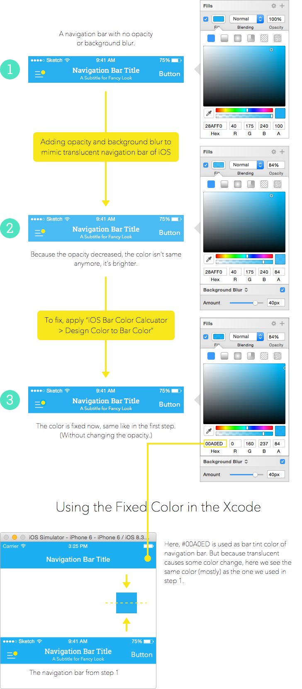

# Sketch-iOS-Bar-Color-Calculator

A Sketch plugin that calculates and applies the correct color for you to get actual design color after applying it to a translucent UIToolbar or UINavigationBar.

Calculations are based on [this post by Tom](http://b2cloud.com.au/how-to-guides/bar-color-calculator-for-ios7-and-ios8/). So I just made a Sketch plugin for it.

## Installation

#### Better Way:
1. [Download the Sketch Toolbox plugin manager app](http://sketchtoolbox.com) and install.
2. Search `iOS Bar Color Calculator` in the app and install.

#### Manuel:
1. [Download the files](https://github.com/einancunlu/Sketch-iOS-Bar-Color-Calculator/archive/master.zip) and unzip.
2. Double click the `iOS-Bar-Color-Calculator.sketchplugin` bundle to install.

## Explanation and Usage

### Usage:

- Select the background layer of the bar (single or multiple), and from plugins menu, select: `iOS Bar Color Calcuator` `>` `Design Color to Bar Color`.

- If you want to revert the original color, select: `iOS Bar Color Calcuator` `>` `Bar Color to Design Color`.

### Explanation:

## Important Note:

In iOS, the opacity of a translucent UINavigationBar or UIToolbar isn’t specified in the documents. So, 84% opacity  and 40px blur are just predictions of mine by experiments. This plugin works just for this opacity value with a white background. And there is a small fallibility.  

Moreover, sometimes Apple changes the parameters of iOS — as it’s stated in the post I referred at the beginning too. So you should check things before to be sure. 

## Customization / Contribution:

You can play with the formula to make it better or more flexible. To do that: 

1. Open plugin folder by clickling `Plugins` `>` `Reveal Plugins Folder...`
2. Right click `iOS-Bar-Color-Calculator.sketchplugin` and press `Show Package Contents`
3. Open `Contents` `>` `Sketch` `>` `helpers.cocoascript` with an editor. 
4. Play with the formula. It's Javascript mostly.

## Contact

You can contact me from [Twitter](https://twitter.com/einancunlu).